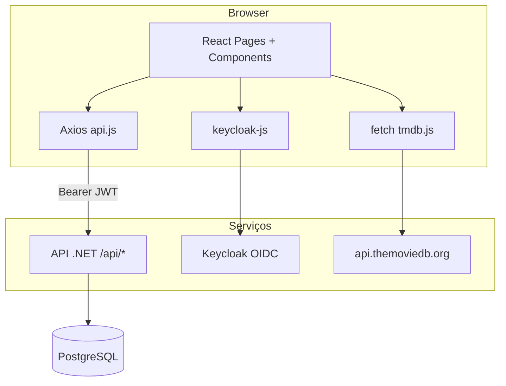

# DesenvWeb Front — SPA React

Interface web do projeto **Desenvolvimento de Sistemas Web (UFSC)** — comunidade de filmes com notas TMDB, favoritos por usuário e comentários. O front é uma **SPA** em **React 19 + Vite 8**, estilizada com **Tailwind CSS v4**, autenticada com **Keycloak** (PKCE) e integrada à **API .NET** e ao catálogo externo **TMDB**.

> Documentação do backend: [`../DesenvWebApi/README.md`](../DesenvWebApi/README.md)

---

## Índice

1. [Stack tecnológica](#stack-tecnológica)
2. [Pré-requisitos](#pré-requisitos)
3. [Instalação e execução](#instalação-e-execução)
4. [Variáveis de ambiente](#variáveis-de-ambiente)
5. [Como o projeto inicializa](#como-o-projeto-inicializa)
6. [Arquitetura geral](#arquitetura-geral)
7. [Estrutura de pastas](#estrutura-de-pastas)
8. [Rotas e páginas](#rotas-e-páginas)
9. [Camada de serviços e API](#camada-de-serviços-e-api)
10. [Integração TMDB](#integração-tmdb)
11. [Componentes — responsabilidades](#componentes--responsabilidades)
12. [Gestão de estado e padrões](#gestão-de-estado-e-padrões)
13. [Autenticação (Keycloak)](#autenticação-keycloak)
14. [Resolução de problemas](#resolução-de-problemas)

---

## Stack tecnológica

| Tecnologia | Uso no projeto |
|------------|----------------|
| **React 19** | UI em componentes funcionais (`.jsx`) |
| **Vite 8** | Dev server, build e variáveis `import.meta.env` |
| **React Router DOM 7** | Rotas e layout aninhado (`Outlet`) |
| **Axios** | Cliente HTTP para a API .NET (`services/api.js`) |
| **keycloak-js** | Login obrigatório, refresh de token, logout |
| **Tailwind CSS v4** | Estilos utilitários (`@import "tailwindcss"`) |
| **Lucide React** | Ícones |
| **React Toastify** | Notificações (`useToast` + `ToastContainer`) |
| **TMDB API** | Pesquisa e importação de filmes (`fetch` em `tmdb.js`) |

**Não utilizado** (por alinhamento com o modelo da disciplina): TypeScript, Redux, React Query, bibliotecas de formulário.

---

## Pré-requisitos

- [Node.js](https://nodejs.org/) **18+** (recomendado LTS)
- **npm** (incluído com o Node)
- Stack em execução:
  - **Docker Compose** na pasta `DesenvWebApi` (PostgreSQL + Keycloak) — ver README da API
  - **API .NET** em `http://localhost:5113` (porta HTTP do `launchSettings`)
- Conta e chave de API no [TMDB](https://www.themoviedb.org/settings/api) (para importar filmes e sincronizar gêneros)

Ordem sugerida ao desenvolver:

```bash
# 1) Na pasta DesenvWebApi
docker compose up -d
dotnet run

# 2) Na pasta DesenvWebFront (este projeto)
npm install
npm run dev
```

O Vite serve por padrão em **`http://localhost:5173`**.

---

## Instalação e execução

```bash
cd DesenvWebFront
npm install
```

### Desenvolvimento

```bash
npm run dev
```

Abra a URL indicada no terminal (normalmente `http://localhost:5173`). O navegador será redirecionado para o **Keycloak** se ainda não houver sessão.

### Build de produção

```bash
npm run build
npm run preview   # pré-visualizar o build estático
```

### Lint

```bash
npm run lint
```

---

## Variáveis de ambiente

O Vite carrega arquivos `.env`, `.env.local`, `.env.development`, etc. Na raiz do front, crie ou edite **`.env.development`** (ou `.env`):

| Variável | Descrição | Exemplo |
|----------|-----------|---------|
| `VITE_KEYCLOAK_URL` | URL do Keycloak (HTTP) | `http://localhost:8080` |
| `VITE_KEYCLOAK_REALM` | Realm importado pelo Docker | `desenvweb` |
| `VITE_KEYCLOAK_CLIENT_ID` | Cliente público SPA | `desenvweb-spa` |
| `VITE_API_URL` | Origem da API **sem** `/api` | `http://localhost:5113` |
| `VITE_TMDB_API_KEY` | Chave v3 do TMDB | *(sua chave)* |
| `VITE_DISABLE_HMR` | Opcional: `true` desliga HMR (útil no Safari) | `true` |

**Importante:** só variáveis com prefixo `VITE_` são expostas ao browser. A chave TMDB fica visível no cliente — aceitável em desenvolvimento; em produção o ideal é um proxy na API.

Após alterar `.env`, **reinicie** o `npm run dev`.

---

## Como o projeto inicializa

O arranque **não** monta o React imediatamente: primeiro garante autenticação Keycloak.

```
index.html
    └── main.jsx
            ├── createKeycloakClient()     → keycloak.js (singleton)
            ├── keycloak.init({ onLoad: 'login-required', pkceMethod: 'S256', ... })
            │       ├── sucesso → createRoot(#root).render(...)
            │       └── falha   → mensagem HTML no #root (Docker/Keycloak parado?)
            └── React tree:
                    StrictMode
                    └── BrowserRouter
                            ├── App.jsx          (Routes)
                            └── ToastContainer     (react-toastify)
```

### `main.jsx`

1. Cria o cliente Keycloak com variáveis `VITE_KEYCLOAK_*`.
2. Chama `init` com **`login-required`** — usuário não autenticado vai para a tela de login.
3. Usa **PKCE (`S256`)** e `redirectUri` estável (`origin + pathname`) para coincidir com o client SPA no realm.
4. Só após `authenticated === true` monta `App` dentro de `BrowserRouter` e registra o `ToastContainer`.

### `App.jsx`

Define rotas filhas de um **layout compartilhado** (`Layout`):

| Rota | Página |
|------|--------|
| `/` | Redireciona para `/inicio` |
| `/inicio` | Feed da comunidade |
| `/meus-filmes` | Favoritos do usuário |
| `/importar` | Pesquisa local + TMDB e importação |

---

## Arquitetura geral



- **Páginas** (`*Page.jsx`): orquestram estado, chamam *services* e passam props aos componentes de apresentação.
- **Services**: funções assíncronas que encapsulam endpoints e mapeamentos (ex.: TMDB → corpo de `POST /filmes/cache`).
- **`api.js`**: instância Axios única; em cada pedido renova o token e envia `Authorization: Bearer …`; em **401** tenta refresh e repete uma vez.

---

## Estrutura de pastas

```
DesenvWebFront/
├── public/                    # Assets estáticos (cataneo-logo.png, …)
├── src/
│   ├── main.jsx               # Entrada: Keycloak → React
│   ├── App.jsx                # Rotas
│   ├── keycloak.js            # Singleton Keycloak
│   ├── index.css              # Tailwind + animações
│   ├── components/
│   │   ├── layout/            # Layout, Sidebar, TopBar, BrandLogo
│   │   ├── inicio/            # InicioPage, PerfilFavoritosPainel
│   │   ├── perfil/            # MeusFilmesPage
│   │   ├── importar/          # ImportarFilmesPage
│   │   ├── filmes/            # Cards, modal, pesquisa
│   │   └── ui/                # Modal, ConfirmDialog, Toast
│   ├── hooks/
│   │   └── useToast.js        # Encapsula react-toastify
│   └── services/
│       ├── api.js             # Axios + interceptors + mensagemErroApi
│       ├── filmesService.js
│       ├── favoritosService.js
│       ├── comentariosService.js
│       ├── generoService.js
│       └── tmdb.js            # Cliente TMDB (não passa pela API .NET)
├── .env.development           # Variáveis locais (não commitar segredos reais)
├── postcss.config.js          # @tailwindcss/postcss
├── vite.config.js             # React + React Compiler; HMR opcional
└── package.json
```

---

## Rotas e páginas

Todas as rotas usam o **`Layout`** (sidebar em drawer + top bar + área de conteúdo com scroll).

### `InicioPage` (`/inicio`)

**Orquestrador principal** do feed:

| Responsabilidade | Detalhe |
|------------------|---------|
| Perfil | `GET /api/usuarios/me` (dados espelhados do Keycloak) |
| Feed de filmes | `listarFilmesFeed` → preferencialmente `GET /filmes/feed`; fallback para `GET /filmes` com normalização de campos |
| Favoritos | `listarFavoritos`, `adicionarFavorito`, `removerFavorito` — estado local |
| Gêneros | `listarGeneros` para filtro no feed |
| Comentários em destaque | `listarComentariosDestaque(12)` |
| Filtros / ordenação | Client-side: nome, gênero, ordem (comunidade, nota TMDB, recentes, estreia, A–Z) |
| Modal de detalhe | `obterFilme(id)` + `FilmeDetalheModal` |

Após alternar favorito no feed, chama **`recarregarFilmes()`** para atualizar `totalFavoritos` nos cards.

### `MeusFilmesPage` (`/meus-filmes`)

Lista apenas filmes **favoritos** do usuário (`GET /favoritos` com `Filme` incluído). Vista em grelha ou lista; reutiliza `FilmeGridCard`, `FilmeFeedCard` e `FilmeDetalheModal`.

### `ImportarFilmesPage` (`/importar`)

| Responsabilidade | Detalhe |
|------------------|---------|
| Pesquisa local | `buscarFilmesLocais` (debounce 400 ms, mín. 2 caracteres) |
| Pesquisa TMDB | `searchMovies` (até 20 resultados) |
| Sincronização de gêneros | Ao montar: `listarGeneros` + `sincronizarGenerosDoTmdb` se houver sessão e chave TMDB |
| Importar filme | `obterFilmePorTmdb` → se não existir, `getMovieDetails` (gênero) → `upsertFilmeCache` |

---

## Camada de serviços e API

Base URL: **`${VITE_API_URL}/api`** (definida em `api.js`).

### Cliente HTTP (`api.js`)

| Funcionalidade | Comportamento |
|----------------|---------------|
| Request interceptor | `updateToken(60)` + header `Authorization: Bearer` |
| Response interceptor (401) | Refresh forçado + **uma** repetição do pedido; se falhar → `kc.login()` |
| `mensagemErroApi(error)` | Extrai `mensagem`, `detail`, `title` ou primeira entrada de `errors` (ASP.NET) |

**Nota CORS:** não se define `Content-Type: application/json` globalmente no Axios — em GET evita preflight desnecessário (relevante no Safari).

### Endpoints utilizados

| Service | Métodos principais | Rotas API |
|---------|-------------------|-----------|
| `filmesService.js` | `listarFilmesFeed`, `buscarFilmesLocais`, `obterFilme`, `obterFilmePorTmdb`, `upsertFilmeCache`, `mapTmdbSearchResultToFilme` | `/filmes`, `/filmes/feed`, `/filmes/buscar`, `/filmes/{id}`, `/filmes/tmdb/{id}`, `/filmes/cache` |
| `favoritosService.js` | `listarFavoritos`, `adicionarFavorito`, `removerFavorito` | `/favoritos`, `/favoritos/{filmeId}` |
| `comentariosService.js` | CRUD + destaque | `/comentarios`, `/comentarios/destaque`, `/comentarios/{id}` |
| `generoService.js` | `listarGeneros`, `sincronizarGenerosDoTmdb` | `/generos`, `/generos/sync` |
| *(direto em páginas)* | Perfil | `GET /usuarios/me` |

Rotas que **exigem JWT** (usuário autenticado): favoritos, criar/editar/apagar comentários, importar filme, sync de gêneros, etc. A listagem pública de filmes e comentários pode funcionar conforme a política da API.

### Exemplo de fluxo — favoritar

```
FilmeFeedCard → onToggleFavorito
    → InicioPage.alternarComAtualizarFeed
        → favoritosService.adicionarFavorito(filmeId)   [POST /favoritos]
        → setFavoritosLista (estado local)
        → recarregarFilmes()                          [atualiza totalFavoritos]
```

### Exemplo de fluxo — comentário no modal

```
FilmeDetalheModal (aberto com filme completo)
    → listarComentariosPorFilme(filme.id)
    → criarComentario → setComentarios(prev => [novo, ...prev])   // sem re-fetch da lista
    → editarComentario / apagarComentario → atualização local + ConfirmDialog na remoção
```

---

## Integração TMDB

Ficheiro: **`src/services/tmdb.js`**

| Função | Descrição |
|--------|-----------|
| `getTmdbApiKey()` | Lê `VITE_TMDB_API_KEY` |
| `posterUrl(path, size)` | Monta URL `https://image.tmdb.org/t/p/{size}{path}` |
| `searchMovies(query)` | `GET /search/movie` |
| `getMovieDetails(id)` | Detalhes com `genres` e `runtime` (necessário na importação) |
| `getMovieGenreList()` | Lista oficial de gêneros (enviada à API em `/generos/sync`) |

O **`filmesService.mapTmdbSearchResultToFilme`** converte um filme TMDB no corpo esperado por `POST /api/filmes/cache` (inclui `filmeDescricao`, primeiro gênero por `generoTmdbId`, etc.).

**ImportarFilmesPage** e **Importar** dependem da chave TMDB; sem ela, a pesquisa na base local continua a funcionar.

---

## Componentes — responsabilidades

### Layout

| Componente | Função |
|------------|--------|
| **`Layout.jsx`** | Grelha `100dvh`: overlay + `Sidebar` (drawer), `TopBar`, `main` com `Outlet` e scroll independente; bloqueia scroll do `body` com menu aberto |
| **`Sidebar.jsx`** | Navegação (`NavLink`), logo, logout Keycloak; drawer oculto por padrão (`-translate-x-full`), abre pelo menu |
| **`TopBar.jsx`** | Botão menu, logo (desktop), **`MovieSearch`** |
| **`BrandLogo.jsx`** | Imagem `/cataneo-logo.png` com fallback ícone `Film` |

### Filmes (apresentação)

| Componente | Função |
|------------|--------|
| **`FilmeFeedCard.jsx`** | Cartão em **lista**; `id="filme-{id}"` para scroll desde a pesquisa ou painel de favoritos; poster, nota TMDB, contagem de favoritos, botão coração |
| **`FilmeGridCard.jsx`** | Mesmo contrato de props, layout em **grelha** |
| **`FilmeDetalheModal.jsx`** | Overlay full-screen: sinopse, favorito, lista de comentários, criar/editar/apagar (máx. 8000 caracteres); estado local dos comentários |
| **`MovieSearch.jsx`** | Na TopBar: debounce → `buscarFilmesLocais`; dropdown; clique faz scroll até `#filme-{id}` no feed |

### Início / perfil

| Componente | Função |
|------------|--------|
| **`PerfilFavoritosPainel.jsx`** | Sidebar direita (desktop) ou bloco no mobile: nome/email, atalhos aos favoritos, link para `/meus-filmes` |

### UI reutilizável

| Componente | Função |
|------------|--------|
| **`Modal.jsx`** | Diálogo genérico: Escape, clique fora, bloqueio de scroll, tamanhos `sm`/`md`/`lg` |
| **`ConfirmDialog.jsx`** | Confirmação destrutiva (ex.: apagar comentário) sobre `Modal` |
| **`Toast.jsx`** | *(se existir wrapper custom)* — notificações via **`useToast`** → `react-toastify` |

### Hooks

| Hook | Função |
|------|--------|
| **`useToast.js`** | `success`, `error`, `info` — evita importar `toast` em todos os arquivos |

---

## Gestão de estado e padrões

Alinhado ao **`.cursorrules`** da disciplina:

| Padrão | Aplicação neste projeto |
|--------|-------------------------|
| Estado local | `useState` nas páginas orquestradoras; sem Redux/React Query |
| Carregamento inicial | `useEffect` + funções `carregar*` / `recarregar*` |
| Após POST/PUT/DELETE | Atualizar arrays com `setX(prev => …)` — **não** refetch completo, exceto quando necessário (ex.: `totalFavoritos` no feed) |
| Paralelo | `Promise.all` quando várias entidades são necessárias ao montar (padrão recomendado; páginas atuais podem carregar em efeitos separados) |
| Erros da API | `mensagemErroApi(e)` + `toast.error(...)` |
| Debounce | Pesquisas (`MovieSearch`, `ImportarFilmesPage`) — 380–400 ms |
| Cancelamento | Flag `cancelado` / `ativo` em efeitos assíncronos para evitar race conditions |
| Estilos | Apenas classes Tailwind; animações `animate-fade-in` em `index.css` |
| Ícones | Apenas Lucide React |

### Âncoras no DOM

Cards de filme expõem **`id="filme-{filmeId}"`** para:

- pesquisa na TopBar (`scrollIntoView`);
- atalhos no painel de favoritos na página inicial.

---

## Autenticação (Keycloak)

| Aspeto | Implementação |
|--------|----------------|
| Modo | SPA pública, **PKCE S256**, `login-required` |
| Realm / client | `desenvweb` / `desenvweb-spa` (import Docker — ver API README) |
| Token na API | Interceptor Axios em `api.js` |
| Logout | `Sidebar` → `getKeycloak().logout({ redirectUri: origin })` |
| Falha no init | Mensagem vermelha em `main.jsx` com URL do Keycloak |

Usuários de teste e credenciais estão documentados no **README da API** e nos arquivos em `DesenvWebApi/docker/keycloak/`.

---

## Resolução de problemas

| Sintoma | Possível causa | O que fazer |
|---------|----------------|-------------|
| Tela vermelha “Falha ao iniciar o Keycloak” | Docker/Keycloak parado ou URL errada | `docker compose up -d` na API; confirme `VITE_KEYCLOAK_URL=http://localhost:8080` |
| Loop de login / redirect | `redirectUri` não autorizado no client | Client SPA no realm deve aceitar `http://localhost:5173/*` |
| 401 em todos os pedidos | API sem JWT ou relógio/token expirado | Confirme se a API está em execução; faça logout/login; veja a rede no DevTools |
| CORS / “access control checks” (Safari) | Preflight ou API sem CORS | API deve expor CORS; evite headers desnecessários em GET (já tratado em `api.js`) |
| Importar TMDB não aparece | Sem `VITE_TMDB_API_KEY` | Defina a chave no `.env.development` e reinicie o Vite |
| “Nenhum filme na base” na pesquisa | Filme ainda não importado | Use **Importar filmes** ou importe a partir do TMDB |
| WebSocket / HMR suspenso (Safari) | Separador em segundo plano | `VITE_DISABLE_HMR=true` ou recarregue a página manualmente |
| Porta da API errada | `launchSettings` diferente de 5113 | Ajuste `VITE_API_URL` para a porta HTTP real da API |

### Verificar ligação à API

Com sessão iniciada, no DevTools → Rede, um pedido a `http://localhost:5113/api/filmes` deve incluir header **`Authorization: Bearer eyJ…`**.

---

## Scripts npm

| Comando | Descrição |
|---------|-----------|
| `npm run dev` | Servidor de desenvolvimento Vite |
| `npm run build` | Build estático em `dist/` |
| `npm run preview` | Serve o build localmente |
| `npm run lint` | ESLint no projeto |

---

## Créditos e dados externos

- Metadados e imagens de filmes: [The Movie Database (TMDB)](https://www.themoviedb.org/)
- Autenticação: [Keycloak](https://www.keycloak.org/)
- Projeto acadêmico — **Desenvolvimento de Sistemas Web**, UFSC (Prof. Matheus Cataneo)
